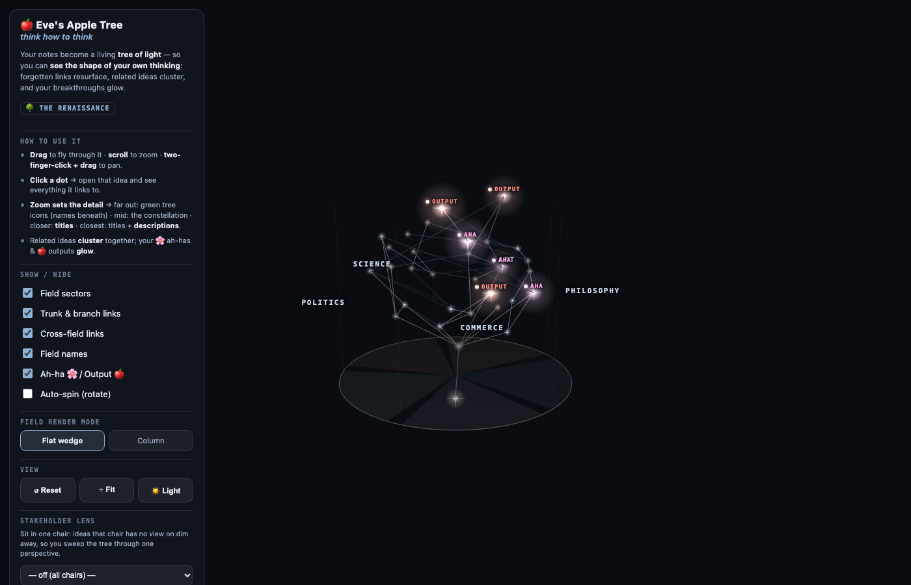
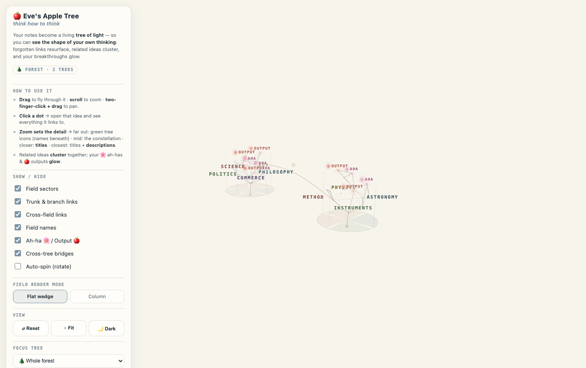
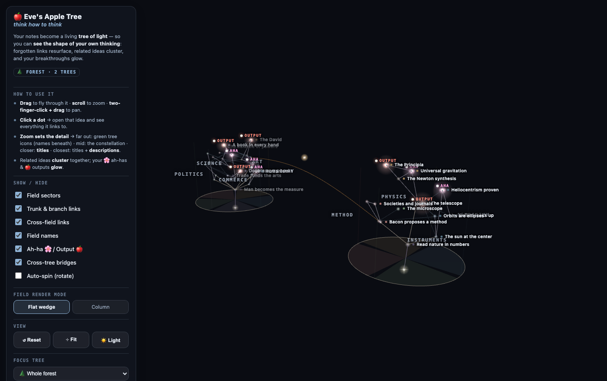
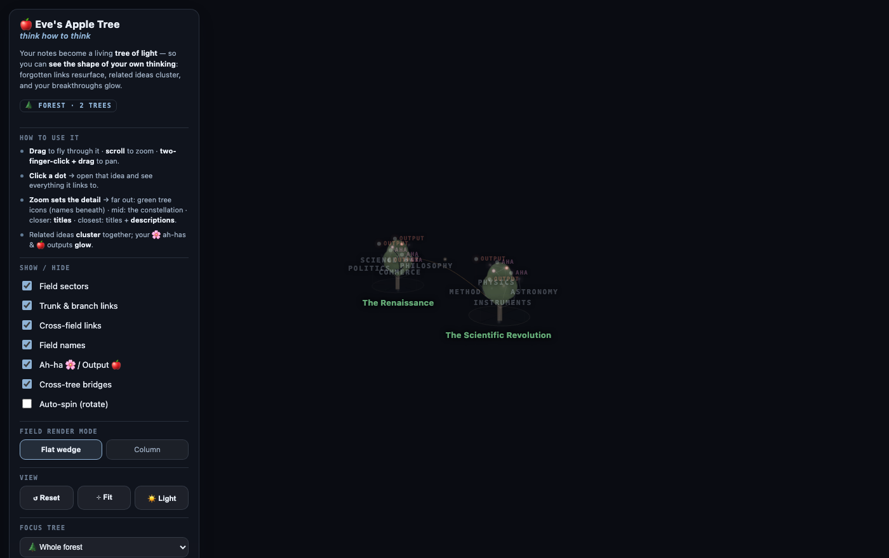

# 🍎 Eve Apple Tree Thinking System — Obsidian Plugin

> Grow your notes into a living **3D "tree of light."** A thinking tool, not a filing cabinet.

Eve's Apple Tree is a thinking system with AI. This plugin is one half of it: it renders your notes as a calm, warm-white **tree of light** you can fly around in 3D. The other half is **Eve's tree team (AI companion kit)**: a gardener you think out loud with, a challenger that pushes back from the outside, and an observer that learns how you think. The plugin ships no AI of its own. You download the team from the [GitHub repo](https://github.com/BrandtheBrand/eve-apple-tree) and the two run as one package.

Eve's tree team tends the tree with you. It proposes leaves and trunk connections; you decide what to keep. It never creates your ah-ha moments or your outputs, and it writes nothing to your vault without your approval.



*The tree of light: your notes as a constellation you can fly around. Ah-ha moments and outputs glow.*

---

## Get started: zero to an AI-tended tree

The fastest path is one download that has everything wired together already.

1. **Get the repo.** Download or clone [github.com/BrandtheBrand/eve-apple-tree](https://github.com/BrandtheBrand/eve-apple-tree) (green **Code** button → **Download ZIP**), then unzip it.
2. **Open the starter vault.** In Obsidian, choose **Open folder as vault** and pick `eve-thinking-system/starter-vault/`. The plugin is preinstalled, Eve's tree team is wired in, and a small example tree (**My First Tree**) is already inside, so you never face an empty screen.
3. **Turn on the tree.** Open **Settings → Community plugins**, turn community plugins on if Obsidian asks, and confirm **Eve Apple Tree Thinking System** is enabled. Open the command palette (`Cmd/Ctrl + P`), type **"tree"**, and run the open-tree command. My First Tree stands up in 3D.
4. **Wake the team.** Open the same folder with **Claude Code** and say *"Gardener, let's think."* The gardener greets you and offers a short voice-calibration exercise so it titles ideas the way you would, not in generic AI voice. (No Claude Code? Paste the vault's `CLAUDE.md` into any capable AI as its system prompt.)
5. **Plant a thought.** Say something you're chewing on. The gardener turns it into a clean leaf, proposes a link or a trunk connection, and hands you a question from a lens you skipped. You choose what to keep. When you say *"oh!"*, it offers to save that as a flower; you bloom it, it never does.
6. **Watch it grow.** Rebuild the tree from the panel and your dot is there. Come back tomorrow with another. The team proposes, you decide, and the tree grows taller over time and wider across fields.

**Prefer to work by hand?** The tree renders straight from plain YAML frontmatter, so you can write every dot yourself and never involve an AI. The [frontmatter schema](#how-it-works--frontmatter-drives-the-tree) is below.

---

## What you're looking at

Notes become **leaves**, placed by **field** (the lens you were thinking through) and **time** (height). Links are the **rhizome**. Breakthroughs are **flowers**; the things you make are **apples**. Zoom in and titles surface, then descriptions; zoom out and the whole tree becomes a translucent green silhouette.

**One folder = one tree.** Put each topic in its own top-level folder and your vault becomes a **forest** of independent trees standing side by side.



*Light mode. One folder = one tree; several folders read as a forest, connected only by explicit bridge notes.*



*Zoom sets the detail. Fly closer and titles surface; closer still and descriptions appear.*



*Zoom all the way out and every tree crossfades into a green tree silhouette with its name beneath.*

---

## Features

- 🌳 **3D "tree of light"** view (three.js) in a locked warm-white observatory aesthetic. Runs fully offline; three.js is bundled, no network calls.
- 🌲 **Forest** — each top-level folder is its own independent tree (own fields, own trunk, own place in the scene). Zoom out and each tree crossfades into a translucent green tree silhouette; several folders read as a forest. A **Focus tree** selector flies you to any one tree or back to the whole forest.
- 🧲 **Link-aware clustering** — dots in the same field that link to each other pull together into clusters, while unrelated dots sit apart (toggle in settings).
- 🔭 **Zoom-driven labels (LOD):** zoomed out is a clean constellation; zoom in for **titles**, further for **descriptions**.
- 🌫️ **Two field modes:** flat ground wedges, or translucent vertical **columns** per field.
- 🌸 **Flower / 🍎 Apple markers** — locate ah-ha moments and outputs at a glance; a bloomed/fruited tree even shows 🌸/🍎 on its zoom-out silhouette.
- 🌙 **Dark mode** — follows Obsidian's light/dark theme automatically; the dots become glowing "diamonds" on black. A 🌙/☀️ button in the panel overrides.
- ✨ **Every dot glows** — a soft halo tinted to each dot's own colour, with ah-has and outputs glowing brightest, tuned separately for light and dark themes. A **Light shine** slider sweeps the glow from subtle to strong as you watch. Dark mode is where it shows best.
- 👁 **Stakeholder views + chair lens** — a note can carry a `## Stakeholder views` section (different "chairs" and their takes); a lens dims every dot that has no view from the chosen chair, so you can sit in one perspective and sweep the tree.
- 🌉 **Cross-tree bridges** — connect two trees only through a "bridge" note that explains the link (never an automatic cross-tree line).
- 🖱️ **Click a dot for its card** — title, description, field, any stakeholder views, and its links to and from other notes, with an **Open note ↗** button that opens the note in a new tab. Bridge nodes open the same way and show their explanation. Close the card with ✕, Esc, or a click on the background.
- ✋ **Hand-placeable dots** — drag any leaf, ah-ha 🌸, or output 🍎 to arrange it; the position saves automatically and comes back after a rebuild or an app restart. A dot stays inside its own field wedge, so the picture can never misrepresent a note's field; to move a dot into another field, change the note's `field` property. Root and trunk dots are fixed anchors. **⌾ Reset dot layout** (double-click to confirm) returns everything to auto-layout.
- 🎛️ **Control-panel upgrades** — the panel minimizes to a small pill; a **Text size** slider scales every label live; a **Zoom-out icon** selector sets the far-zoom silhouette shape (Round, Conifer, or Apple, an apple-tree crown with its fruit baked in).
- ♿ Respects `prefers-reduced-motion` (auto-spin, when you enable it manually, is exempt by design). Desktop-only (heavy WebGL).

---

## How it works — frontmatter drives the tree

Each note carries small YAML frontmatter:

```yaml
---
tree_type: leaf          # root | trunk | leaf | flower | apple
field: Researcher        # the lens/sector (omit for root & trunk)
time: 2026-06-26         # ISO date or number → height (old low, new high)
title: What counts as evidence   # optional; defaults to the file name
---
```

- **Folder → tree.** Every note in the same top-level folder belongs to one tree. Name the folder whatever you want the tree called (e.g. `The Renaissance`).
- **`field`** → an angular **sector**. Any field names you use become sectors automatically.
- **`time`** → **height**. Older notes sit lower; the tree grows upward. Use EITHER real dates OR plain numbers (tiers) consistently within one folder. Mixing the two skews heights, since numbers read as days-since-1970.
- **`[[wikilinks]]`** in the body → edges. Links to trunk/root read as structure; links **across fields** read as faint **rhizome**, the lateral connections that matter most.
- **Stakeholder views (optional):** add a `## Stakeholder views` section with `- **Chair:** their take` lines, or a `views:` frontmatter array.
- **Bridge note (optional):** a note with `bridge_from: <folder>` + `bridge_to: <folder>` (+ optional `bridge_from_note` / `bridge_to_note`, `title`, `explain`) draws the one allowed connection between two trees; click it to open the bridge note.
- Partial frontmatter is handled gracefully: a note that carries *some* tree keys but not others defaults to `leaf`, an "Unfiled" field, and its creation date. With **Only show notes with tree frontmatter** on (the default), a note carrying *no* tree keys at all is hidden until you tag it or switch that setting off.

Use **Rebuild from vault** in the panel after adding or editing notes (live auto-refresh is on the roadmap).

### Settings
- **Only show notes with tree frontmatter** — **on by default.** The tree renders only notes that carry `tree_type` / `field` / `time` / `flower` frontmatter, so a mixed vault stays clean and fast. Turn it **off** to render every note in the vault (whole-vault mode). If a fresh vault shows an empty view, this is why: tag a note (see above) or switch this off.
- **Forest mode (one folder = one tree)** — on by default; off renders the whole vault as a single tree.
- **Cluster linked dots** — on by default; the link-aware clustering above. Skipped automatically for trees over 500 notes to keep Obsidian responsive.

---

## Installing by hand

The starter vault above already has the plugin inside it. To add the plugin to a vault of your own:

### From a release (recommended)
1. Download `main.js`, `manifest.json`, and `styles.css` from the latest release.
2. Copy them into `<your-vault>/.obsidian/plugins/eve-apple-tree/`.
3. **Settings → Community plugins**, enable **Eve Apple Tree Thinking System**.
4. Open the tree from the **sprout** ribbon icon or the command palette → *"Open the tree of light."*

### From source
```bash
cd plugin
npm install
npm run build      # produces main.js (tsc type-check + esbuild bundle)
# copy main.js + manifest.json + styles.css into the plugin folder above
```
`npm run dev` watches and rebuilds while you work.

To add Eve's tree team to your own vault (rather than using the starter vault), follow `eve-thinking-system/agents/README.md`.

---

## Controls

- **Drag** = orbit · **scroll** = zoom (toward the cursor) · **two-finger-click + drag** = pan.
- **Reset view** / **Recenter & fit** buttons in the panel.
- **🌙/☀️** button — toggle dark mode manually (otherwise follows your Obsidian theme).
- **Zoom in** to reveal titles, then descriptions; **zoom out** for the green forest.
- **Click a dot** to open its card (title, description, field, stakeholder views, links); **Open note ↗** opens the note in a new tab. Close with ✕, Esc, or a background click.
- **Drag a dot** to place it by hand inside its field wedge; the position saves automatically. **⌾ Reset dot layout** (double-click) restores auto-layout.
- Panel toggles: field sectors, structural/rhizome links, field names, flower/apple markers, cross-tree bridges, auto-spin, and **Flat wedge ↔ Column**. Sliders for **Text size** and **Light shine**, a **Zoom-out icon** shape selector (Round / Conifer / Apple), and a **minimize** button that collapses the panel to a pill.

---

## Roadmap

- Live refresh on `metadataCache` changes (no manual rebuild).
- Instanced dots with culling for very large vaults.
- Per-vault custom palettes.

---

## License

MIT — see `LICENSE`.
